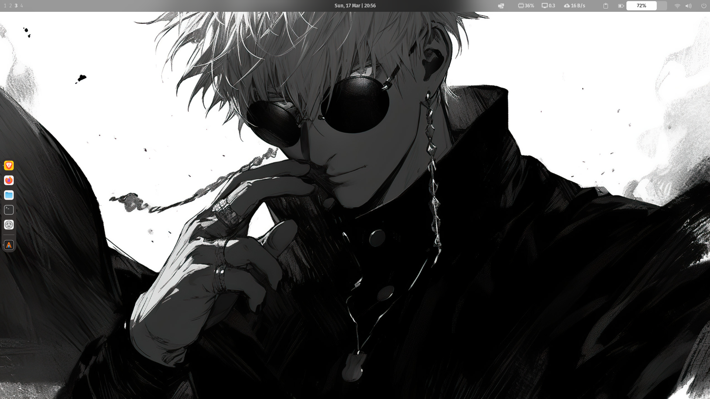

Hello forks, this is my workstation previews 
> This repo only contains the pictures of my workstation, my config repo is private🔒 

```javascript
const myWorkstation = {
    WM: "PopOS",
    Theme: "Graphite",
    Icons: "Colliod-grey",
    Cursor: "Graphite-dark-nord-cursors"
}

val messageFromUser = "PopOS is awesome...."
```

## Home preview


## Extension preview


## Neovim preview

